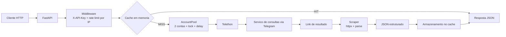

# Consultas API


API REST self-hosted em FastAPI para automatizar consultas em um serviço de consultas via Telegram e devolver o resultado em JSON estruturado.

O projeto encapsula o fluxo completo de automação: recebe a requisição HTTP, valida o payload, aplica autenticação e rate limiting, escolhe uma conta Telegram disponível, executa a consulta no serviço upstream, busca o resultado e devolve uma resposta pronta para integração com outros sistemas.

Cada usuário hospeda a sua própria instância, configura as suas próprias credenciais e opera a API no ambiente que preferir.

## Principais recursos

- API HTTP com FastAPI e documentação OpenAPI automática em `/docs`.
- Automação de consultas via Telethon usando duas contas Telegram em round-robin.
- Retry automático em outra conta quando a primeira tentativa falha por timeout.
- Cache em memória com TTL configurável e header `X-Cache`.
- Rate limiting por IP na camada HTTP e por conta na camada Telegram.
- Logs estruturados em JSON para stdout.
- Empacotamento com Docker e `docker compose`.
- Endpoints de health check e status operacional.

## Arquitetura



Fluxo resumido:

1. O cliente envia uma requisição para `http://localhost:8000`.
2. A API valida a `X-API-Key`, aplica o limite por IP e verifica o cache.
3. Em caso de `MISS`, o `AccountPool` escolhe uma conta Telegram livre e respeita o delay mínimo por conta.
4. O worker envia o comando, seleciona a sub-base quando necessário e aguarda o link de resultado.
5. O scraper tenta obter os dados estruturados e converte o retorno em JSON.
6. A resposta é enviada ao cliente com `X-Cache: MISS` e fica disponível no cache por até `CACHE_TTL_HOURS`.

## Stack tecnológica

| Componente | Tecnologia | Papel no projeto |
| --- | --- | --- |
| API HTTP | FastAPI | Rotas, serialização, OpenAPI e ciclo de vida da aplicação |
| Cliente Telegram | Telethon | Envio de comandos, clique em botões inline e espera por eventos |
| HTTP client | httpx | Busca do resultado retornado pelo serviço Telegram |
| Validação e settings | Pydantic v2 + pydantic-settings | Schemas de request/response e leitura do `.env` |
| Parser | selectolax | Fallback para extração de HTML quando necessário |
| Logs | python-json-logger | Saída estruturada em JSON |
| Containerização | Docker + Docker Compose | Empacotamento e execução self-hosted |

## Requisitos

- Python 3.12 é o ambiente de referência do projeto e da imagem Docker.
- O pacote declara compatibilidade com Python 3.11+, mas a documentação e os exemplos assumem Python 3.12.
- Duas `StringSession` válidas para as contas Telegram configuradas no `.env`.
- Acesso ao grupo onde o serviço de consultas responde.
- Docker e Docker Compose são opcionais.

## Instalação local

1. Crie e ative um ambiente virtual.

```bash
python -m venv .venv
source .venv/bin/activate
```

No Windows PowerShell:

```powershell
.\.venv\Scripts\Activate.ps1
```

2. Instale as dependências.

```bash
pip install -r requirements.txt
```

3. Copie o arquivo de exemplo de ambiente.

```bash
cp .env.example .env
```

4. Gere uma API key forte.

```bash
python -c "import secrets; print(secrets.token_urlsafe(32))"
```

5. Preencha o `.env` com as credenciais Telegram, sessions e a chave gerada.

6. Inicie a API.

```bash
uvicorn app.main:app --host 0.0.0.0 --port 8000 --reload
```

7. Verifique se o serviço subiu corretamente.

```bash
curl http://localhost:8000/api/health
```

8. Opcionalmente, rode o teste manual do MVP.

```bash
python test_manual.py
```

Endpoints úteis em desenvolvimento:

- `http://localhost:8000/docs`
- `http://localhost:8000/redoc`
- `http://localhost:8000/api/health`

## Instalação com Docker

1. Crie e preencha o `.env` na raiz do projeto.
2. Suba o container.

```bash
docker compose up --build -d
```

3. Acompanhe os logs.

```bash
docker compose logs -f api
```

4. Faça um health check local.

```bash
curl http://localhost:8000/api/health
```

Observações sobre Docker:

- O container expõe a porta `8000` internamente.
- O `docker-compose.yml` publica `8000:8000` por padrão.
- O health check interno usa `curl http://localhost:8000/api/health`.

## Variáveis de ambiente

Todas as variáveis disponíveis em `app/config.py` estão documentadas em `.env.example`.

| Variável | Obrigatória | Padrão | Descrição |
| --- | --- | --- | --- |
| `TELEGRAM_API_ID` | Sim | - | API ID da aplicação Telegram |
| `TELEGRAM_API_HASH` | Sim | - | API hash da aplicação Telegram |
| `TELEGRAM_SESSION_STRING_BRYAN` | Sim | - | `StringSession` da primeira conta Telegram |
| `TELEGRAM_SESSION_STRING_BRYAN2` | Sim | - | `StringSession` da segunda conta Telegram |
| `TELEGRAM_GROUP_ID` | Sim | - | ID numérico do grupo onde o serviço responde |
| `TELEGRAM_TIMEOUT` | Não | `15` | Timeout de espera pelas respostas do serviço Telegram |
| `RATE_LIMIT_INTERVAL` | Não | `3.0` | Intervalo mínimo entre consultas da mesma conta |
| `MAX_REQUESTS_PER_MINUTE` | Não | `20` | Limite por IP em janela de 60 segundos |
| `CACHE_TTL_HOURS` | Não | `24` | TTL do cache em memória, em horas |
| `API_SECRET_KEY` | Recomendado | `""` | Chave principal aceita nos endpoints protegidos |
| `API_KEYS` | Não | `""` | Chaves adicionais separadas por vírgula |
| `API_HOST` | Não | `0.0.0.0` | Valor de referência para sua operação local/infra |
| `API_PORT` | Não | `8000` | Valor de referência para sua operação local/infra |
| `CORS_ORIGINS` | Não | `*` | Lista de origens permitidas, separadas por vírgula |

Exemplo mínimo:

```env
TELEGRAM_API_ID=12345678
TELEGRAM_API_HASH=seu_telegram_api_hash
TELEGRAM_SESSION_STRING_BRYAN=sua_string_session_bryan
TELEGRAM_SESSION_STRING_BRYAN2=sua_string_session_bryan2
TELEGRAM_GROUP_ID=-1002396715550
TELEGRAM_TIMEOUT=15
RATE_LIMIT_INTERVAL=3.0
MAX_REQUESTS_PER_MINUTE=20
CACHE_TTL_HOURS=24
API_SECRET_KEY=sua-api-key-aqui
API_KEYS=
CORS_ORIGINS=*
```

## Autenticação

A autenticação é feita via header `X-API-Key`.

Regras atuais:

- Todos os endpoints em `/api/*`, exceto `/api/health`, exigem `X-API-Key`.
- A API aceita a chave principal definida em `API_SECRET_KEY`.
- A API também aceita chaves extras informadas em `API_KEYS`, separadas por vírgula.
- Se nenhuma chave estiver configurada no servidor, os endpoints protegidos retornam `503 Service Unavailable`.
- Se a chave estiver ausente ou incorreta, a API retorna `401 Unauthorized`.

Exemplo:

```bash
curl http://localhost:8000/api/status \
  -H "X-API-Key: sua-api-key-aqui"
```

## Rate limiting e concorrência

### Limite por IP

- Aplicado a todos os endpoints `/api/*`, exceto `/api/health`.
- Usa `MAX_REQUESTS_PER_MINUTE` em uma janela deslizante de 60 segundos.
- Ao exceder o limite, a API retorna `429 Too Many Requests` com o header `Retry-After`.

### Limite por conta Telegram

- Cada conta respeita `RATE_LIMIT_INTERVAL` segundos entre consultas consecutivas.
- O delay é aplicado no momento em que a conta é adquirida pelo `AccountPool`.
- O pool mantém um lock por conta, então existe no máximo uma consulta ativa por conta.

### Concorrência efetiva

- Com duas contas configuradas, a API processa até duas consultas simultâneas no upstream Telegram.
- Se uma conta der timeout, a API tenta novamente usando outra conta disponível.
- O retry automático ocorre apenas para timeout. Erros de negócio do serviço Telegram são retornados imediatamente.

## Cache

O cache é implementado em memória por processo.

Comportamento atual:

- A chave do cache é um `sha256(command::base)`.
- O TTL é controlado por `CACHE_TTL_HOURS`.
- A resposta inclui `X-Cache: HIT` quando servida do cache.
- A resposta inclui `X-Cache: MISS` quando a consulta precisou passar pelo fluxo Telegram + scraper.
- Reiniciar a API limpa todo o cache.
- O cache não é compartilhado entre múltiplas instâncias.

## Headers de resposta úteis

| Header | Quando aparece | Significado |
| --- | --- | --- |
| `X-Cache` | Endpoints de consulta | `HIT` para cache, `MISS` para processamento completo |
| `Retry-After` | Respostas `429` | Segundos recomendados antes de tentar novamente |

## Endpoints

Observação importante: o envelope de sucesso é sempre o mesmo, mas o conteúdo de `data` varia conforme o tipo de consulta e conforme o retorno do serviço upstream.

| Método | Rota | Auth | Descrição |
| --- | --- | --- | --- |
| `GET` | `/api/health` | Não | Health check básico |
| `GET` | `/api/status` | Sim | Estado das contas, cache, uptime e último erro |
| `POST` | `/api/consulta/cpf` | Sim | Consulta CPF com sub-bases gratuitas |
| `POST` | `/api/consulta/nome` | Sim | Consulta por nome completo |
| `POST` | `/api/consulta/telefone` | Sim | Consulta por telefone com DDD |
| `POST` | `/api/consulta/cep` | Sim | Consulta CEP sem sub-base |
| `POST` | `/api/consulta/email` | Sim | Consulta por e-mail |
| `POST` | `/api/consulta/ip` | Sim | Consulta por IPv4 |
| `POST` | `/api/consulta/titulo` | Sim | Consulta título de eleitor |
| `POST` | `/api/consulta/pix` | Sim | Consulta PIX na base padrão `pix` |
| `POST` | `/api/consulta` | Sim | Endpoint genérico para roteamento por `tipo` |

### GET /api/health

```bash
curl http://localhost:8000/api/health
```

```json
{
  "status": "ok",
  "accounts": 2,
  "uptime": 125.381
}
```

### GET /api/status

```bash
curl http://localhost:8000/api/status \
  -H "X-API-Key: sua-api-key-aqui"
```

```json
{
  "accounts": [
    {"label": "bryan", "status": "connected"},
    {"label": "bryan2", "status": "connected"}
  ],
  "cache_size": 3,
  "uptime": 532.204,
  "queries_today": 27,
  "last_error": {
    "timestamp": "2026-05-02T18:00:00+00:00",
    "type": "subscription",
    "message": "Base requer assinatura",
    "context": {
      "tipo": "pix",
      "account": "bryan"
    }
  }
}
```

### POST /api/consulta/cpf

Bases aceitas: `completo`, `fotos`, `vizinhos`, `empregos`, `vacinas`, `beneficios`, `internet`, `obito`, `compras`.

```bash
curl -X POST http://localhost:8000/api/consulta/cpf \
  -H "Content-Type: application/json" \
  -H "X-API-Key: sua-api-key-aqui" \
  -d '{"cpf":"12974572936","base":"completo"}'
```

```json
{
  "status": "success",
  "link": "https://resultado-exemplo.invalid/result-consultation/cpf_abc123?bot=",
  "data": {
    "dados_basicos": {
      "nome": "LORENZO CRISTIANINI DE OLIVEIRA",
      "cpf": "12974572936",
      "data_nascimento": "07/01/2010",
      "situacao_cadastral": "REGULAR"
    },
    "enderecos": [
      {
        "logradouro": "PENHA, 127",
        "bairro": "ATLANTICO II",
        "cidade_uf": "CIANORTE/PR",
        "cep": "87202040"
      }
    ]
  }
}
```

### POST /api/consulta/nome

Bases aceitas: `nome`, `nome_mae`.

```bash
curl -X POST http://localhost:8000/api/consulta/nome \
  -H "Content-Type: application/json" \
  -H "X-API-Key: sua-api-key-aqui" \
  -d '{"nome":"João da Silva Santos","base":"nome"}'
```

```json
{
  "status": "success",
  "link": "https://resultado-exemplo.invalid/result-consultation/nome_abc123?bot=",
  "data": {
    "dados_basicos": {
      "nome": "JOAO DA SILVA SANTOS",
      "cpf": "12974572936",
      "data_nascimento": "07/01/2010"
    }
  }
}
```

### POST /api/consulta/telefone

```bash
curl -X POST http://localhost:8000/api/consulta/telefone \
  -H "Content-Type: application/json" \
  -H "X-API-Key: sua-api-key-aqui" \
  -d '{"telefone":"44988030666","base":"telefone"}'
```

```json
{
  "status": "success",
  "link": "https://resultado-exemplo.invalid/result-consultation/tel_abc123?bot=",
  "data": {
    "dados_basicos": {
      "telefone": "44988030666",
      "nome": "JOAO DA SILVA",
      "cidade_uf": "CIANORTE/PR"
    }
  }
}
```

### POST /api/consulta/cep

```bash
curl -X POST http://localhost:8000/api/consulta/cep \
  -H "Content-Type: application/json" \
  -H "X-API-Key: sua-api-key-aqui" \
  -d '{"cep":"87020025"}'
```

```json
{
  "status": "success",
  "link": "https://resultado-exemplo.invalid/result-consultation/cep_abc123?bot=",
  "data": {
    "dados_basicos": {
      "cep": "87020025",
      "logradouro": "AVENIDA BRASIL",
      "bairro": "CENTRO",
      "cidade_uf": "MARINGA/PR"
    }
  }
}
```

### POST /api/consulta/email

```bash
curl -X POST http://localhost:8000/api/consulta/email \
  -H "Content-Type: application/json" \
  -H "X-API-Key: sua-api-key-aqui" \
  -d '{"email":"joao@gmail.com","base":"email"}'
```

```json
{
  "status": "success",
  "link": "https://resultado-exemplo.invalid/result-consultation/email_abc123?bot=",
  "data": {
    "dados_basicos": {
      "email": "joao@gmail.com",
      "nome": "JOAO DA SILVA",
      "cidade_uf": "CIANORTE/PR"
    }
  }
}
```

### POST /api/consulta/ip

```bash
curl -X POST http://localhost:8000/api/consulta/ip \
  -H "Content-Type: application/json" \
  -H "X-API-Key: sua-api-key-aqui" \
  -d '{"ip":"8.8.8.8"}'
```

```json
{
  "status": "success",
  "link": "https://resultado-exemplo.invalid/result-consultation/ip_abc123?bot=",
  "data": {
    "dados_basicos": {
      "ip": "8.8.8.8",
      "pais": "Estados Unidos",
      "organizacao": "Google LLC"
    }
  }
}
```

### POST /api/consulta/titulo

```bash
curl -X POST http://localhost:8000/api/consulta/titulo \
  -H "Content-Type: application/json" \
  -H "X-API-Key: sua-api-key-aqui" \
  -d '{"titulo":"018921371805"}'
```

```json
{
  "status": "success",
  "link": "https://resultado-exemplo.invalid/result-consultation/titulo_abc123?bot=",
  "data": {
    "dados_basicos": {
      "titulo": "018921371805",
      "nome": "JOAO DA SILVA",
      "zona": "123",
      "secao": "456"
    }
  }
}
```

### POST /api/consulta/pix

O endpoint específico `/api/consulta/pix` usa a base `pix` por padrão.

```bash
curl -X POST http://localhost:8000/api/consulta/pix \
  -H "Content-Type: application/json" \
  -H "X-API-Key: sua-api-key-aqui" \
  -d '{"nome":"douglas da costa silva","meio_cpf":"226471"}'
```

```json
{
  "status": "success",
  "link": "https://resultado-exemplo.invalid/result-consultation/pix_abc123?bot=",
  "data": {
    "dados_basicos": {
      "nome": "DOUGLAS DA COSTA SILVA",
      "meio_cpf": "226471",
      "instituicao": "BANCO EXEMPLO"
    }
  }
}
```

### POST /api/consulta

Endpoint genérico para quem prefere escolher `tipo` e `base` em um único payload. Também é a forma de acionar a base `pix2`.

```bash
curl -X POST http://localhost:8000/api/consulta \
  -H "Content-Type: application/json" \
  -H "X-API-Key: sua-api-key-aqui" \
  -d '{"tipo":"pix","input":"douglas da costa silva|226471","base":"pix2"}'
```

```json
{
  "status": "success",
  "link": "https://resultado-exemplo.invalid/result-consultation/pix2_abc123?bot=",
  "data": {
    "dados_basicos": {
      "nome": "DOUGLAS DA COSTA SILVA",
      "meio_cpf": "226471",
      "instituicao": "BANCO EXEMPLO"
    }
  }
}
```

## Estrutura de pastas

```text
consultas-api/
├── app/
│   ├── config.py
│   ├── main.py
│   ├── models/
│   ├── routes/
│   ├── services/
│   └── utils/
├── .env.example
├── Dockerfile
├── docker-compose.yml
├── requirements.txt
├── pyproject.toml
├── test_manual.py
└── README.md
```

Resumo dos diretórios e arquivos principais:

- `app/config.py`: leitura do `.env` e propriedades derivadas, como a lista de API keys aceitas.
- `app/main.py`: inicialização da aplicação, middleware de auth/rate limit, lifespan, health e status.
- `app/models/`: schemas Pydantic de entrada e saída.
- `app/routes/consultas.py`: endpoints HTTP e orquestração do fluxo de consulta.
- `app/services/account_pool.py`: seleção das contas Telegram com lock e round-robin.
- `app/services/telegram_worker.py`: envio do comando, clique em botões e tratamento das respostas do serviço.
- `app/services/scraper.py`: busca e parse do resultado estruturado.
- `app/services/cache.py`: cache em memória com TTL e chave SHA-256.
- `app/services/request_rate_limiter.py`: rate limit por IP.
- `app/services/runtime_state.py`: métricas simples de runtime e último erro.
- `app/utils/logger.py`: logging JSON para stdout.
- `.env.example`: template completo das variáveis de ambiente.
- `test_manual.py`: script de smoke test para a rota de CPF.

## Erros e códigos HTTP

| Código | Cenário |
| --- | --- |
| `401 Unauthorized` | `X-API-Key` ausente ou inválida |
| `403 Forbidden` | A base consultada exige assinatura ativa |
| `404 Not Found` | O serviço Telegram não encontrou resultado para a consulta |
| `422 Unprocessable Entity` | Payload inválido, base incompatível ou input rejeitado |
| `429 Too Many Requests` | Limite por IP excedido |
| `503 Service Unavailable` | Serviço upstream em manutenção ou autenticação do servidor não configurada |
| `504 Gateway Timeout` | Timeout em todas as contas disponíveis durante a consulta |
| `500 Internal Server Error` | Falha inesperada no processamento interno |

Exemplo de erro `401`:

```json
{
  "detail": "API key ausente ou inválida."
}
```

Exemplo de erro `429`:

```json
{
  "detail": "Rate limit excedido. Tente novamente mais tarde."
}
```

## Limitações conhecidas

- O fluxo do serviço Telegram pode mudar sem aviso, inclusive alternando entre editar a mensagem original e responder com uma nova mensagem em reply.
- O cache é somente em memória e é perdido ao reiniciar a aplicação.
- O rate limiting por IP é local ao processo; múltiplas instâncias não compartilham contadores.
- O endpoint `/api/consulta/pix` usa apenas a base `pix`; para `pix2`, utilize o endpoint genérico.
- O endpoint `/api/consulta/ip` valida apenas IPv4.
- `API_HOST` e `API_PORT` existem na configuração, mas o comando padrão do Uvicorn e o Dockerfile continuam usando `0.0.0.0:8000` explicitamente.
- A UI em `/docs` documenta os schemas, mas a autenticação por `X-API-Key` é aplicada por middleware; para chamadas autenticadas, `curl` ou Postman continuam sendo as formas mais previsíveis de teste.

## Contribuindo

Contribuições são bem-vindas.

Fluxo sugerido:

1. Abra uma issue ou descreva o problema com contexto suficiente.
2. Crie uma branch para a sua alteração.
3. Rode a API localmente e valide o fluxo afetado.
4. Se alterar contrato HTTP, atualize também a documentação.
5. Envie um pull request com escopo objetivo e descrição clara.

Checklist recomendado antes de abrir PR:

- Verificar se o `.env.example` continua compatível com `app/config.py`.
- Testar pelo menos `GET /api/health` e um endpoint de consulta.
- Revisar logs e mensagens de erro geradas pela alteração.
- Atualizar o [CHANGELOG.md](CHANGELOG.md) quando a mudança for relevante para usuários do projeto.

## Changelog

O histórico de releases está em [CHANGELOG.md](CHANGELOG.md).

## Licença

Distribuído sob a licença MIT. Veja [LICENSE](LICENSE) para o texto completo.