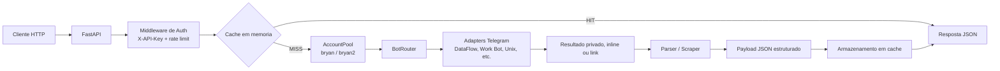

# Consultas API V2 - Multi-Bot


API REST self-hosted em FastAPI para executar consultas via múltiplos bots Telegram, com fallback automático, autenticação por API key, cache em memória, métricas operacionais e empacotamento para produção.

O fluxo principal é:

1. Receber a requisição HTTP.
2. Validar a API key e aplicar rate limit por chave.
3. Verificar cache em memória.
4. Escolher uma conta Telegram disponível.
5. Percorrer a chain de adapters do tipo solicitado.
6. Retornar o primeiro resultado bem-sucedido em JSON.

## Principais recursos

- 6 adapters Telegram com chains de fallback por tipo.
- 2 contas Telegram operando em pool com controle de concorrência.
- Rate limit por API key e rate limit interno por conta e por grupo.
- Cache em memória com suporte a stale fallback.
- Health tracking, success rate, cooldown e circuit breaker por adapter.
- Captcha solver via VoidAI para fluxos do Work Bot.
- OpenAPI/Swagger com documentação por endpoint e esquema X-API-Key.
- Docker multi-stage com usuário não-root e worker único para compatibilidade com Telethon.
- Graceful shutdown com espera de consultas em andamento e flush de métricas no log.

## Arquitetura



## Requisitos

- Python 3.12+.
- Duas StringSession válidas para Telegram.
- Acesso aos grupos usados pelos bots.
- Chave da VoidAI para captcha do Work Bot.
- Docker e Docker Compose são opcionais, mas recomendados para produção.

## Setup local

1. Crie e ative um ambiente virtual.

```bash
python -m venv .venv
source .venv/bin/activate
```

No Windows PowerShell:

```powershell
.\.venv\Scripts\Activate.ps1
```

2. Instale as dependências.

```bash
pip install -r requirements.txt
```

3. Copie o template de ambiente.

```bash
cp .env.example .env
```

4. Preencha o arquivo .env com as credenciais Telegram, grupos, chaves da API e VoidAI.

5. Suba a API.

```bash
uvicorn app.main:app --host 0.0.0.0 --port 8000 --workers 1 --reload
```

6. Verifique a saúde do serviço.

```bash
curl http://localhost:8000/api/health
```

## Docker

Build e subida local:

```bash
docker compose up -d --build
```

Logs:

```bash
docker compose logs -f consultas-api
```

Health check:

```bash
curl http://localhost:8000/api/health
```

Notas de produção:

- O container expõe a porta 8000.
- O processo usa uvicorn com --workers 1.
- O compose usa logging json-file com rotação.
- O graceful shutdown respeita stop_grace_period de 35 segundos.

## Variáveis de ambiente

O arquivo completo está em .env.example. As principais variáveis são:

| Variável | Obrigatória | Descrição |
| --- | --- | --- |
| TELEGRAM_API_ID | Sim | API ID da aplicação Telegram |
| TELEGRAM_API_HASH | Sim | API hash da aplicação Telegram |
| TELEGRAM_SESSION_STRING_BRYAN | Sim | StringSession da primeira conta |
| TELEGRAM_SESSION_STRING_BRYAN2 | Sim | StringSession da segunda conta |
| GROUP_BLACK_CONSULTAS | Sim | Grupo do Black Consultas |
| GROUP_DATAFLOW | Sim | Grupo do DataFlow |
| GROUP_DON | Sim | Grupo DON |
| GROUP_TAMAKI | Sim | Grupo TAMAKI |
| GROUP_UNEN | Sim | Grupo UNEN |
| VOIDAI_API_KEY | Sim para /placa via Work Bot | API key da VoidAI |
| VOIDAI_MODEL | Não | Modelo do solver de captcha. Padrão: gemini-2.0-flash |
| API_KEYS | Sim em produção | Lista de chaves separadas por vírgula |
| API_SECRET_KEY | Não | Alias legado para chave única |
| CORS_ORIGINS | Não | Origens permitidas separadas por vírgula |
| CACHE_TTL_HOURS | Não | TTL do cache em horas |
| RATE_LIMIT_INTERVAL | Não | Delay mínimo entre consultas na mesma conta |
| MAX_REQUESTS_PER_MINUTE | Não | Rate limit por API key em janela de 60 segundos |
| TELEGRAM_TIMEOUT | Não | Timeout por etapa de interação com bots |

## Autenticação e rate limit

- Endpoints públicos: /api/health, /api/metrics, /docs, /redoc e /openapi.json.
- Todos os outros endpoints exigem o header X-API-Key.
- O limite padrão é por API key, não por IP.
- Se nenhuma key estiver configurada, endpoints protegidos retornam 503.

Exemplo:

```bash
curl http://localhost:8000/api/status \
  -H "X-API-Key: change-me-key1"
```

Para adicionar uma nova API key:

1. Edite API_KEYS no .env, separando por vírgula.
2. Reinicie a aplicação ou o container.

Exemplo:

```env
API_KEYS=change-me-key1,change-me-key2,nova-chave-de-producao
```

## Sistema de fallback

Cada tipo de consulta possui uma chain fixa de adapters. O router tenta o adapter principal e, em caso de timeout, erro de negócio, indisponibilidade ou circuito aberto, segue para o próximo adapter saudável.

Exemplos de prioridade:

- cpf: dataflow -> work_bot -> unknowrealbot -> voidsearch -> black_consultas
- cep: unix_robot -> dataflow -> work_bot -> voidsearch -> black_consultas
- placa: work_bot -> unknowrealbot -> voidsearch

Com duas contas Telegram livres, o router também pode acionar failover paralelo para reduzir latência.

## Endpoints de sistema

### GET /api/health

```bash
curl http://localhost:8000/api/health
```

### GET /api/metrics

```bash
curl http://localhost:8000/api/metrics
```

### GET /api/status

```bash
curl http://localhost:8000/api/status \
  -H "X-API-Key: change-me-key1"
```

### GET /api/status/bots

```bash
curl http://localhost:8000/api/status/bots \
  -H "X-API-Key: change-me-key1"
```

### GET /api/debug/chain/{tipo}

```bash
curl "http://localhost:8000/api/debug/chain/cpf" \
  -H "X-API-Key: change-me-key1"
```

### GET /api/debug/last-errors

```bash
curl http://localhost:8000/api/debug/last-errors \
  -H "X-API-Key: change-me-key1"
```

### DELETE /api/cache/{tipo}/{input}

```bash
curl -X DELETE "http://localhost:8000/api/cache/cpf/12974572936?base=completo" \
  -H "X-API-Key: change-me-key1"
```

## Catálogo de consultas

Os exemplos abaixo usam http://localhost:8000 e a API key change-me-key1. O envelope de sucesso é sempre:

```json
{
  "status": "success",
  "link": "",
  "data": {}
}
```

### Pessoa

#### POST /api/consulta/cpf

Chain: dataflow -> work_bot -> unknowrealbot -> voidsearch -> black_consultas

```bash
curl -X POST http://localhost:8000/api/consulta/cpf \
  -H "Content-Type: application/json" \
  -H "X-API-Key: change-me-key1" \
  -d '{"cpf":"12974572936","base":"completo"}'
```

#### POST /api/consulta/nome

Chain: dataflow -> work_bot -> unix_robot -> voidsearch -> black_consultas

```bash
curl -X POST http://localhost:8000/api/consulta/nome \
  -H "Content-Type: application/json" \
  -H "X-API-Key: change-me-key1" \
  -d '{"nome":"João da Silva Santos","base":"nome"}'
```

#### POST /api/consulta/telefone

Chain: dataflow -> work_bot -> unknowrealbot -> voidsearch -> black_consultas

```bash
curl -X POST http://localhost:8000/api/consulta/telefone \
  -H "Content-Type: application/json" \
  -H "X-API-Key: change-me-key1" \
  -d '{"telefone":"44988030666","base":"telefone"}'
```

#### POST /api/consulta/email

Chain: dataflow -> work_bot -> unknowrealbot -> black_consultas

```bash
curl -X POST http://localhost:8000/api/consulta/email \
  -H "Content-Type: application/json" \
  -H "X-API-Key: change-me-key1" \
  -d '{"email":"joao@gmail.com","base":"email"}'
```

#### POST /api/consulta/cnpj

Chain: dataflow -> work_bot -> voidsearch

```bash
curl -X POST http://localhost:8000/api/consulta/cnpj \
  -H "Content-Type: application/json" \
  -H "X-API-Key: change-me-key1" \
  -d '{"cnpj":"33000167000101"}'
```

#### POST /api/consulta/mae

Chain: work_bot -> dataflow -> unknowrealbot

```bash
curl -X POST http://localhost:8000/api/consulta/mae \
  -H "Content-Type: application/json" \
  -H "X-API-Key: change-me-key1" \
  -d '{"nome":"Maria Alves"}'
```

#### POST /api/consulta/foto

Chain: work_bot -> dataflow -> unknowrealbot

```bash
curl -X POST http://localhost:8000/api/consulta/foto \
  -H "Content-Type: application/json" \
  -H "X-API-Key: change-me-key1" \
  -d '{"cpf":"07068093868"}'
```

#### POST /api/consulta/rg

Chain: work_bot -> unix_robot

```bash
curl -X POST http://localhost:8000/api/consulta/rg \
  -H "Content-Type: application/json" \
  -H "X-API-Key: change-me-key1" \
  -d '{"rg":"234730742"}'
```

#### POST /api/consulta/pai

Chain: work_bot -> unknowrealbot

```bash
curl -X POST http://localhost:8000/api/consulta/pai \
  -H "Content-Type: application/json" \
  -H "X-API-Key: change-me-key1" \
  -d '{"nome":"Jose Silva"}'
```

#### POST /api/consulta/cns

Chain: work_bot

```bash
curl -X POST http://localhost:8000/api/consulta/cns \
  -H "Content-Type: application/json" \
  -H "X-API-Key: change-me-key1" \
  -d '{"cns":"705005484822659"}'
```

#### POST /api/consulta/chave

Chain: work_bot

```bash
curl -X POST http://localhost:8000/api/consulta/chave \
  -H "Content-Type: application/json" \
  -H "X-API-Key: change-me-key1" \
  -d '{"cpf":"07068093868"}'
```

#### POST /api/consulta/vizinhos

Chain: work_bot -> black_consultas

```bash
curl -X POST http://localhost:8000/api/consulta/vizinhos \
  -H "Content-Type: application/json" \
  -H "X-API-Key: change-me-key1" \
  -d '{"cpf":"07068093868"}'
```

#### POST /api/consulta/parentes

Chain: work_bot -> black_consultas

```bash
curl -X POST http://localhost:8000/api/consulta/parentes \
  -H "Content-Type: application/json" \
  -H "X-API-Key: change-me-key1" \
  -d '{"cpf":"07068093868"}'
```

#### POST /api/consulta/pep

Chain: work_bot

```bash
curl -X POST http://localhost:8000/api/consulta/pep \
  -H "Content-Type: application/json" \
  -H "X-API-Key: change-me-key1" \
  -d '{"cpf":"07068093868"}'
```

#### POST /api/consulta/titulo

Chain: dataflow -> work_bot -> unknowrealbot

```bash
curl -X POST http://localhost:8000/api/consulta/titulo \
  -H "Content-Type: application/json" \
  -H "X-API-Key: change-me-key1" \
  -d '{"titulo":"018921371805"}'
```

#### POST /api/consulta/pix

Chain: black_consultas

```bash
curl -X POST http://localhost:8000/api/consulta/pix \
  -H "Content-Type: application/json" \
  -H "X-API-Key: change-me-key1" \
  -d '{"nome":"douglas da costa silva","meio_cpf":"226471"}'
```

### Veículo

#### POST /api/consulta/placa

Chain: work_bot -> unknowrealbot -> voidsearch

```bash
curl -X POST http://localhost:8000/api/consulta/placa \
  -H "Content-Type: application/json" \
  -H "X-API-Key: change-me-key1" \
  -d '{"placa":"ABC1D23"}'
```

#### POST /api/consulta/proprietario

Chain: work_bot

```bash
curl -X POST http://localhost:8000/api/consulta/proprietario \
  -H "Content-Type: application/json" \
  -H "X-API-Key: change-me-key1" \
  -d '{"placa":"ABC1D23"}'
```

#### POST /api/consulta/condutor

Chain: work_bot

```bash
curl -X POST http://localhost:8000/api/consulta/condutor \
  -H "Content-Type: application/json" \
  -H "X-API-Key: change-me-key1" \
  -d '{"cpf":"07068093868"}'
```

#### POST /api/consulta/frota

Chain: work_bot

```bash
curl -X POST http://localhost:8000/api/consulta/frota \
  -H "Content-Type: application/json" \
  -H "X-API-Key: change-me-key1" \
  -d '{"cnpj":"33000167000101"}'
```

### Localização

#### POST /api/consulta/cep

Chain: unix_robot -> dataflow -> work_bot -> voidsearch -> black_consultas

```bash
curl -X POST http://localhost:8000/api/consulta/cep \
  -H "Content-Type: application/json" \
  -H "X-API-Key: change-me-key1" \
  -d '{"cep":"01310100"}'
```

#### POST /api/consulta/endereco

Chain: dataflow

```bash
curl -X POST http://localhost:8000/api/consulta/endereco \
  -H "Content-Type: application/json" \
  -H "X-API-Key: change-me-key1" \
  -d '{"cpf":"07068093868"}'
```

#### POST /api/consulta/ddd

Chain: voidsearch

```bash
curl -X POST http://localhost:8000/api/consulta/ddd \
  -H "Content-Type: application/json" \
  -H "X-API-Key: change-me-key1" \
  -d '{"ddd":"19"}'
```

#### POST /api/consulta/ip

Chain: unknowrealbot -> voidsearch -> black_consultas

```bash
curl -X POST http://localhost:8000/api/consulta/ip \
  -H "Content-Type: application/json" \
  -H "X-API-Key: change-me-key1" \
  -d '{"ip":"8.8.8.8"}'
```

### Sistema

#### POST /api/consulta/bin

Chain: dataflow

```bash
curl -X POST http://localhost:8000/api/consulta/bin \
  -H "Content-Type: application/json" \
  -H "X-API-Key: change-me-key1" \
  -d '{"bin":"516230"}'
```

#### POST /api/consulta/processo

Chain: work_bot

```bash
curl -X POST http://localhost:8000/api/consulta/processo \
  -H "Content-Type: application/json" \
  -H "X-API-Key: change-me-key1" \
  -d '{"numero":"1234567"}'
```

#### POST /api/consulta

Endpoint genérico para roteamento por tipo.

```bash
curl -X POST http://localhost:8000/api/consulta \
  -H "Content-Type: application/json" \
  -H "X-API-Key: change-me-key1" \
  -d '{"tipo":"cpf","input":"12974572936","base":"completo"}'
```

## Códigos HTTP comuns

| Código | Cenário |
| --- | --- |
| 401 | API key ausente ou inválida |
| 403 | Base ou bot exige assinatura |
| 404 | Resultado não encontrado |
| 422 | Payload inválido |
| 429 | Rate limit da API key excedido |
| 503 | Todos os bots falharam, serviço em shutdown ou auth do servidor não configurada |
| 504 | Timeout em todas as tentativas disponíveis |
| 500 | Erro interno inesperado |

## Deploy em VPS

O arquivo deploy.sh foi incluído para deploy simples em Oracle VPS:

```bash
chmod +x deploy.sh
./deploy.sh
```

Conteúdo:

```bash
#!/bin/bash
set -euo pipefail

cd /opt/consultas-api
git pull
docker compose down
docker compose up -d --build
docker compose logs -f --tail=50
```

## Troubleshooting

### Swagger abre, mas chamadas retornam 401

Informe o header X-API-Key nas requisições protegidas. O /docs é público, mas a maioria dos endpoints /api não é.

### /api/status ou /api/consulta retornam 503 logo no boot

Verifique se API_KEYS ou API_SECRET_KEY estão configuradas e se as StringSession do Telegram continuam autorizadas.

### Muitas respostas 429

O rate limit agora é por API key. Distribua consumo entre chaves diferentes ou aumente MAX_REQUESTS_PER_MINUTE com cautela.

### /api/consulta/placa falha em captcha

Confira VOIDAI_API_KEY, VOIDAI_MODEL e os logs do Work Bot. O router fará fallback quando houver alternativa saudável.

### Não use múltiplos workers

Telethon não é multiprocess safe neste projeto. Mantenha uvicorn com --workers 1.

## Estrutura principal

```text
consultas-api/
├── app/
│   ├── config.py
│   ├── main.py
│   ├── models/
│   ├── routes/
│   ├── services/
│   └── utils/
├── .env.example
├── Dockerfile
├── docker-compose.yml
├── deploy.sh
├── requirements.txt
├── pyproject.toml
├── README.md
└── test_manual.py
```

## Licença

Distribuído sob a licença MIT. Veja LICENSE.